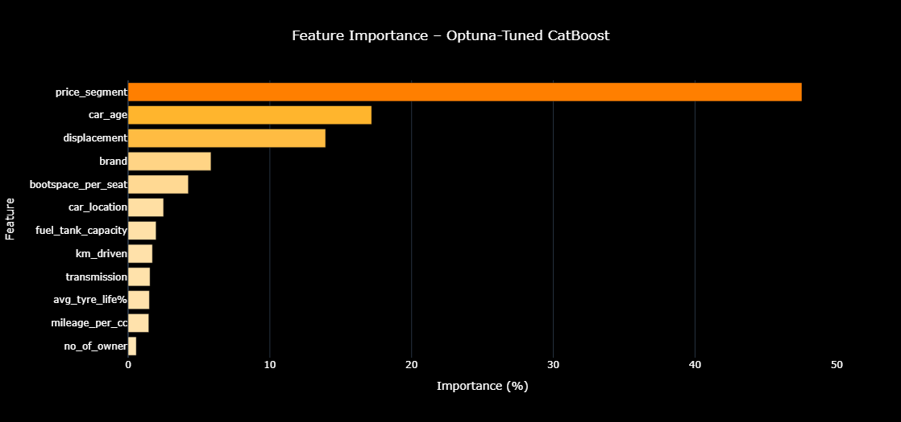

# ResaleRadar – Used Car Price Prediction App


>  Predict resale values of used cars in India using ML-powered insights and a clean Streamlit UI.

##  Overview

**ResaleRadar** is a full-stack machine learning application that predicts the **resale price** of used cars based on real-world car listings. The web app is deployed on **Streamlit Cloud** and is designed to support **Car Sellers / Buyers** – Get a realistic price estimate for a used car.

With advanced feature engineering and a finely-tuned **CatBoost Regressor**, ResaleRadar provides predictions with an **R² score of 0.918**, making it highly reliable for practical use.

---

##  Key Highlights

- **781 Cleaned Rows** of Real-World Car Listings from **Spinny**
- Extensive **Feature Engineering** for impactful predictions
- **Optuna-Tuned CatBoost** for best-in-class regression
- **Streamlit Interface** with Two Input Modes: 
  -  *Know your specs*
  -  *Intelligent defaults based on car brand/model*
- Deployed as a public app: [ResaleRadar on Streamlit](https://resaleradar.streamlit.app)
- 
---

## 🧠 Feature Engineering

Custom features were created to enhance model performance and domain relevance:

| Feature                | Description                                                                 |
|------------------------|-----------------------------------------------------------------------------|
| `car_age`              | Years since the car was purchased                                           |
| `bootspace_per_seat`  | Bootspace divided by seating capacity — indicates practicality              |
| `mileage_per_cc`      | Mileage normalized by engine displacement                                   |
| `price_segment`        | Tiered bucket of car cost to capture market trends                          |
| `brand`               | Kept categorical; handled natively by CatBoost                              |
| `car_location`        | Used as-is to reflect city-level pricing variation                          |

These features were chosen for their **practical impact on resale pricing**. For example:
- **Car age** strongly affects depreciation.
- **Price segment** captures broad economic value categories.
- **Displacement** and **mileage_per_cc** reflect performance-efficiency tradeoffs.

### 🔧 Cleaning & Transformation
- Duplicates and missing rows were removed for robustness.
- Final dataset: **781 clean entries** across **35+ features**.
- Only **car brand** and **car_location (city)** are used directly in model input (no tier clustering used).
- All categorical and numerical transformations were handled based on feature types and CatBoost's internal handling.

---

## 🔍 Model Choice: CatBoost

CatBoost was selected due to its strengths:
- Native support for **categorical variables** (no manual encoding required)
- Strong performance on **medium-sized datasets**
- Built-in regularization and fast training
- Handles **imbalanced** and **noisy data** effectively

No need for additional encoding or complex preprocessing of string features like `brand`, `transmission`, or `location`.

---

## ⚙️ Model Training and Optimization

### Target Transformation
To normalize the target variable `total_cost`, a **log transformation** was applied (`log1p`). This reduces the effect of outliers and improves learning stability.

### Weighted Loss
To avoid large errors in low-cost car predictions, **sample weights** were applied inversely proportional to price — giving more importance to cheaper cars during training.

### Hyperparameter Tuning with Optuna
The model was tuned using **Optuna**, a state-of-the-art optimization framework that uses Tree-structured Parzen Estimators (TPE) for efficient search.

### 🧬 Parameters Tuned
- `depth`
- `learning_rate`
- `l2_leaf_reg`
- `iterations`
- `bagging_temperature`
This tuning helped improve both R² and error metrics significantly.

---

## ✅ Model Performance

| Metric       | Value        |
|--------------|--------------|
| R² Score     | 0.9180       |
| RMSE         | ₹130,455.80  |
| MAE          | ₹88,343.63   |
| MAPE         | 11.87%       |

### Performance Justification
- **R² = 0.9180**: The model explains over 91% of the variation in resale price.
- **RMSE/MAE** values are competitive, especially in a high-variance domain like used cars.
- **MAPE < 12%**: Indicates consistent performance across all price segments.

Weighted loss and log transformation were crucial in achieving balanced performance — especially in avoiding large errors for budget-friendly vehicles.

---

## 📊 Feature Importance



The plot above shows the relative importance of each feature in the Optuna-tuned CatBoost model:

- **price_segment**: Most dominant predictor, helping the model differentiate economic tiers.
- **car_age**: Critical for capturing depreciation.
- **displacement** and **brand**: Together reflect performance and perception of quality.
- Additional features like `bootspace_per_seat` and `car_location` offer supporting value.

---

## 🌐 Streamlit App Interface

### 🎛️ Two User Modes
- **I Know My Specs**: For users who know their car’s detailed specifications.
- **I Don’t Know Specs**: App smartly fills details using **brand+model-based averages** from the dataset.

### App Features
- **Brand and Model Selection**: Auto-prefills key specs (displacement, mileage, etc.)
- **Slider & Dropdown Input**: Intuitive interface to tweak features like owners, km driven
- **Smart Suggestions**: Reduces manual input using backend lookups from dataset

### UI Styling
- Custom dark theme using CSS for a sleek, modern look.
- Key inputs are highlighted, fonts are bold, and important texts use contrast color: `#ed020e`.
- Dropdowns for **brand**, **model**, and **location** improve UX.
- Sliders have sensible pre-set ranges informed by the dataset.

### 📌 Screenshot of Streamlit UI


---

## 🛠️ Tech Stack

| Layer        | Tech                        |
|--------------|-----------------------------|
| ML Model     | CatBoostRegressor (Optuna)  |
| Language     | Python 3.10+                |
| Interface    | Streamlit                   |
| Deployment   | Streamlit Cloud             |
| Data Source  | Spinny Car Listings         |

---

## 📌 Future Enhancements

- Use **external APIs** to pull real-time pricing trends.
- Expand dataset with user-contributed or scraped data.
- Add city clustering (Tier 1/2/3) to better model regional pricing.
- Expand to include more brands, fuel types, and luxury segments.
- Use BERT or LSTM to embed textual fields (e.g., model name) for advanced insights.

---

##  Acknowledgements

- [Spinny](https://www.spinny.com) – for the dataset inspiration
- [Optuna](https://optuna.org) – for hyperparameter tuning
- [CatBoost](https://catboost.ai) – for the regression model
- [Streamlit](https://streamlit.io) – for building the interactive web app

---

## ⚠️ Disclaimer
[car](images/rr.png)

> *This prediction is generated using machine learning models trained on past data. Actual market value may differ depending on demand, condition, negotiation, and dealer margins.*

--- 

## 📂 Repository Structure

```bash
├── code/
│   ├── app.py                     # Streamlit frontend
│   ├── catboost.ipynb             # Initial CatBoost experiments
│   ├── catboost_final_model.cbm   # Trained CatBoost model
│   ├── data_preprocessing.ipynb   # Data cleaning + feature engineering
│   ├── many_models.ipynb          # Baseline models (Ridge, Lasso, etc.)
│   ├── model_inference.py         # Auto-filled feature inference logic
│   └── requirements.txt
│
├── dataset/
│   ├── cars.xlsx                  # Raw dataset from Spinny
│   └── cleaned_car_data.xlsx      # Final cleaned dataset (781 rows)
│
├── images/
│   ├── rr1.png                    # Streamlit UI Screenshot
│   ├── rr2.png                    # Feature Importance Plot
